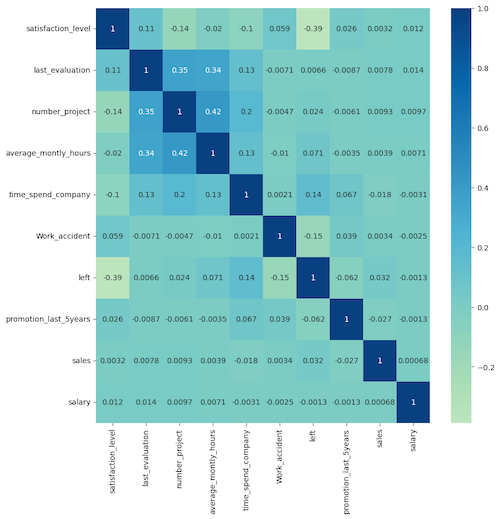

# Employee Churn Prediction

This repository aims to predict employee churn using five different machine learning models (KNN, Random Forest, Naive Bayes, Logistic Regression, and a simple MLP Neural Network) and analyze their results using the [HR Analytics](https://www.kaggle.com/datasets/giripujar/hr-analytics) dataset from Kaggle.

## Overview

This project aims to predict employee churn using five different machine learning models: KNN, Random Forest, Naive Bayes, Logistic Regression, and a simple MLP Neural Network. The challenge is to develop models that can accurately predict which employees are most likely to leave a company, based on a range of input features such as average monthly work hours, recent promotion statuses, and salary. Our approach formulates the problem as a classification task, using the five models mentioned as predictors with various hyperparameters. We evaluated each model's performance using metrics such as accuracy, precision, recall, and F1 score, and compared their results. Our best model was able to achieve an accuracy of 99% on the test data, outperforming the other models.

## Summary of Workdone

### Data

* Data:
  * Input: CSV file of 10 features (satisfaction level, last evaluation, number of projects, average monthly hours, time spent at the company, work accidents, left, promotion in the last 5 years, department, and salary)
  * Output: Predicted binary label on whether an employee will churn or not.
  * Size: 566.79 kB; The original dataset contains 14,999 instances and 10 features.
  * Instances: The data was split into a training set containing 70% of the original data, and a testing set containing 30% of the original data.

#### Preprocessing / Clean up

These preprocessing steps help in cleaning and transforming the dataset in a format that can be used for the machine learning algorithms.
* Missing values are removed using df_raw.dropna() function.
* Boxplots are created for numerical features to identify any outliers or extreme values.
* Categorical variables are encoded (Label encoding replaces each category with a numerical value, with the same value being assigned to all instances of that category and allows the algorithm to process the data)
* The target variable/feature 'left' is separated from the rest of the dataset and stored as the target variable.
* The remaining dataset is stored once target variable is separated

#### Data Visualization

* The correlation matrix heat map can show which features are strongly correlated with the employee churn target variable.
* With the map we can see the strongest correlation, -0.39, with the "left" target feature would be the employee's "satisfaction level"

### Problem Formulation

  * Input: CSV data includes various features: satisfaction level, last evaluation, number of projects, average monthly hours, time spent at the company, work accidents, left, promotion in the last 5 years, department, and salary
  * Output: Predicted binary label on whether an employee will churn or not. 0 represents an employee who is still with the company, while 1 represents an employee who has left the company.
  * Models:
  
      1) K-Nearest Neighbors (KNN)
  * This model was chosen because it's a simple yet effective classification algorithm for small datasets.
  * This is a non-parametric algorithm that classifies a new observation by looking at its k-nearest neighbors in the training set. The classification is based on the most common class among the k-nearest neighbors. 
  * The hyperparameters used in the code are:
      * n_neighbors: The number of neighbors to consider. In this code, it is set to 2.
      * metric: The distance metric used to compute the distance between two observations. In this code, it is set to 'euclidean'.
     
      2) Random Forest
  * This model was chosen because it's an ensemble learning method that can handle nonlinear relationships, interactions, and high dimensional data well.
  * This is an ensemble learning algorithm that combines multiple decision trees to improve the model's accuracy and reduce overfitting. 
  * The hyperparameters used in the code are:
      * n_estimators: The number of trees in the forest. In this code, the default value is used.
      
      3) Naive Bayes
  * This model was chosen because it's a probabilistic classifier that assumes independence among the predictors, and works well with high-dimensional data.
  * This is a probabilistic algorithm that assumes the independence of each feature and predicts the class based on the joint probability of the features.
  * No hyperparameters are used for Gaussian Naive Bayes in this code.
      
      4) Logistic Regression
  * This model was chosen because it's a widely used classification algorithm that's easy to interpret and can handle binary and multi-class problems.
  * This is a parametric algorithm that models the probability of an observation belonging to a class using a logistic function.
  * The hyperparameters used in the code are:
      * max_iter: The maximum number of iterations for the solver to converge. In this code, it is set to 1000.
  
      5) Multilayer Perceptron (MLP) Neural Network
  * This model was chosen because it can capture complex nonlinear relationships and interactions among the predictors, and can handle both binary and multi-class problems.
  * This is a feedforward neural network that consists of multiple layers of nodes, each with a set of weights and biases. The layers are connected in a way that each node in one layer is connected to every node in the next layer. 
  * The hyperparameters used in the code are:
      * epochs: The number of times the training data is used to update the weights. In this code, it is set to 50.
      * batch_size: The number of samples to be used for each update. In this code, it is set to 32.
      * loss: The loss function to be optimized during training. In this code, binary cross-entropy is used.
      * optimizer: The optimizer used to update the weights during training. In this code, Adam optimizer is used.

### Training

* The code implement various machine learning models in Python using the scikit-learn and keras libraries. The code also demonstrates how to evaluate the performance of each model using common evaluation metrics such as confusion matrix and classification report.

KNN:
* Uses the K-nearest neighbors algorithm to classify data points.
* The number of neighbors (K) is set to 2 and the distance metric used is Euclidean distance.
* Trains the model on the training set and predicts the target variable on the test set.

Random Forest:
* Uses a decision tree-based ensemble method to classify data points.
* The default number of decision trees in the forest is 100.
* Trains the model on the training set and predicts the target variable on the test set.
* Uses cross-validation to evaluate the model's performance.

Naive Bayes:
* Uses the Gaussian Naive Bayes algorithm to classify data points.
* Trains the model on the training set and predicts the target variable on the test set.

Logistic Regression:
* Uses the logistic regression algorithm to classify data points.
* The maximum number of iterations is set to 1000.
* Trains the model on the training set and predicts the target variable on the test set.

Neural Network MLP:
* Uses a multi-layer perceptron (MLP) neural network to classify data points.
* The MLP has 3 layers with 64, 32, and 1 neurons, respectively.
* Uses the sigmoid activation function in the output layer.
* Trains the model on the training set for 50 epochs with a batch size of 32 and prints the training progress.
* Predicts the target variable on the test set.

### Performance Comparison

* The performance of the models can be evaluated based on their accuracy, precision, recall, and F1-score.

* From the analysis of the results, it can be observed that KNN, Random Forest, and MLP Neural Network achieved high accuracy, precision, recall, and F1-score of around 0.97. These three models are very good at correctly classifying employees who will churn and those who will not churn.

* On the other hand, Naive Bayes and Logistic Regression did not perform as well as the other models, with an accuracy of 0.79 and 0.76, respectively. The precision, recall, and F1-score for both models are also much lower than those of KNN, Random Forest, and MLP Neural Network. Therefore, Naive Bayes and Logistic Regression may not be the best models for predicting employee churn in this scenario.

### Conclusions

* In summary, KNN, Random Forest, and MLP Neural Network are recommended for predicting employee churn, as they have shown to be more accurate and reliable in the given dataset.

### Future Work

* We would like to do model tuning in the future. Although the models used in this project achieved high accuracy, there may be ways to optimize their hyperparameters to further improve their performance. One approach is to use grid search or randomized search to identify the optimal set of hyperparameters for each model.
* We would also like to consider long-term prediction in the future. In this project, we focused on predicting employee churn in the short term. However, it would be interesting to explore how models can predict employee churn in the long term and whether there are additional factors that contribute to employee retention in the long run. This could potentially help organizations develop more effective retention strategies and reduce the cost of employee turnover.

### Overview of files in repository

* Describe the directory structure, if any.
* List all relavent files and describe their role in the package.
* An example:
  * utils.py: various functions that are used in cleaning and visualizing data.
  * preprocess.ipynb: Takes input data in CSV and writes out data frame after cleanup.
  * visualization.ipynb: Creates various visualizations of the data.
  * models.py: Contains functions that build the various models.
  * training-model-1.ipynb: Trains the first model and saves model during training.
  * training-model-2.ipynb: Trains the second model and saves model during training.
  * training-model-3.ipynb: Trains the third model and saves model during training.
  * performance.ipynb: loads multiple trained models and compares results.
  * inference.ipynb: loads a trained model and applies it to test data to create kaggle submission.

* Note that all of these notebooks should contain enough text for someone to understand what is happening.

### Software Setup
* Required packages:
      * pandas
      * numpy
      * StandardScaler from sklearn.preprocessing
      * train_test_split, classification_report, confusion_matrix from sklearn.model_selection
      * KNeighborsClassifier from sklearn.neighbors
      * RandomForestClassifier, cross_val_score, plot_tree from sklearn.ensemble
      * GaussianNB from sklearn.naive_bayes
      * LogisticRegression from sklearn.linear_model
      * Sequential, Dense from keras.models and keras.layers
      * plot_confusion_matrix from mlxtend.plotting
      * scikitplot, pyplot, ConfusionMatrixDisplay from sklearn.metrics
* Note that scikit-learn, scikit-plot, and keras are installed through pip.

### Data

* Point to where they can download the data.
* Lead them through preprocessing steps, if necessary.

### Training

* Describe how to train the model

#### Performance Evaluation

* Describe how to run the performance evaluation.

## Citations

* Provide any references.

